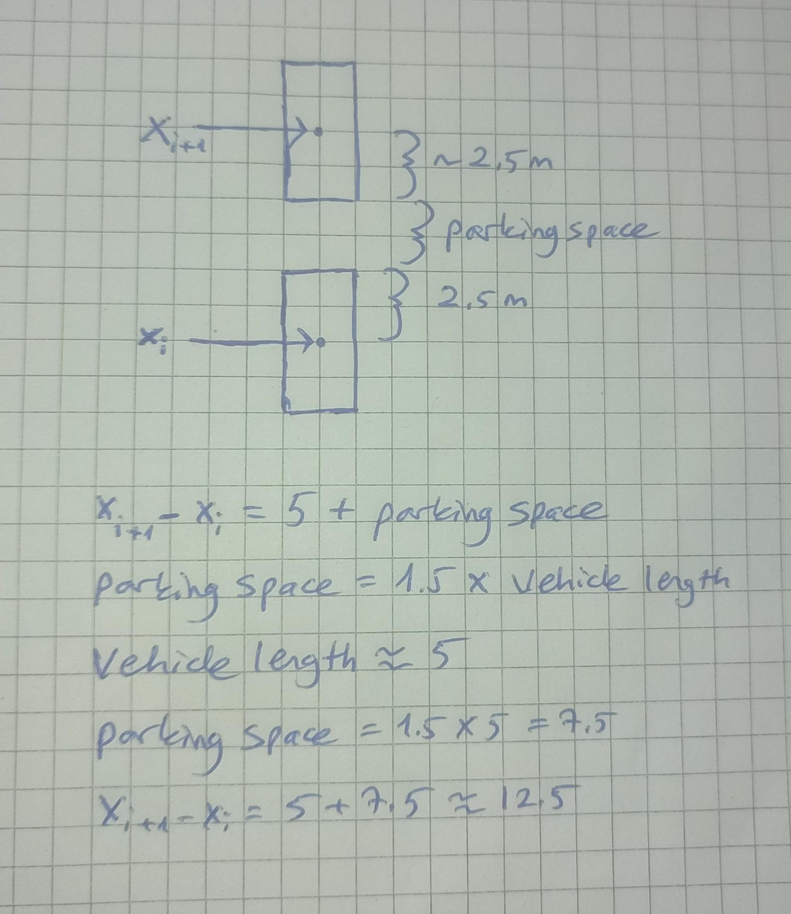

# Hardware setup

## UART-to-USB adapter

Adapter setup is unchanged from the homework assignments.
Connect the adapter as follows:


In words:

- GND is connected to RPi pin 6
- D1 is connected to RPi pin 8
- D0 is connected to RPi pin 10

## TPM

Connect the TPM:


In words:

- RST# is connected to RPi pin 18
- CS1# is connected to RPi pin 26
- The TPM faces "inwards", towards the HDMI port

There is a pin header provided to help positioning. It is used like this:


## Ethernet

Connect the Raspberry Pi and the PC using an ethernet cable. To do this, assign the static IP address 10.0.0.10 to the corresponding ethernet interface. This can be done temporarily with the following command:
```sh
ip addr add 10.0.0.10/24 dev <ethernet-interface-name>
```

# Compiling the TRENTOS application

There are no additional dependencies or changes to the build process.
Just compile it as any other TRENTOS application:

```sh
sdk/scripts/open_trentos_build_env.sh \
    sdk/build-system.sh \
    ws2023_team_3_ads_tpm \
    rpi3 \
    build-rpi3-ws2023_team_3_ads_tpm \
    -DCMAKE_BUILD_TYPE=Debug
```

If the project directory isn't named `ws2023_team_3_ads_tpm`, substitute that
with its actual path. It would be best to clone the project to the main Trentos folder.

# Transferring the build files to SD Card
After inserting the SD card to the computer, please run the following commands:

```sh
cd <Main Trentos Directory>
cp sdk/resources/rpi3_sd_card/* <SD Card mount>
cp <Build Directory>/images/os_image.elf <SD Card mount>
sync
umount <SD Card mount>
```
To find the SD Card mount, the command `df -h` can be used.
# Finding the right device file
After connecting the Raspberry Pi to the computer, if picocom doesn't work with the default device file `/dev/ttyUSB0`, please check which device file was added to `/dev` folder after plugging the rspi.
# Generating and importing a new cEK

If TRENTOS application is run for the first time on a particular TPM, it's
first necessary to let it clear the TPM, take ownership, generate a fresh
cEK, and store it in the NV storage.

On the TRENTOS side, add the following at the beginning of the file
`components/WolfTPM/trentos.c`:

```c
#define CLEAR_TPM
```

Re-compile and re-run. The TRENTOS application will print a hexdump of the
new cEK and exit.

Now, the new key must be imported into the Python client. Do:

```sh
cd python_client/
python3 importEK.py
```

And copy-paste the key into the prompt.

(Sending it over the network would've added significant complexity to the
 WolfTPM component, which doesn't seem worth it for something that ideally
 only runs once.)

Remember to remove the `#define CLEAR_TPM` and re-compile before running
the application again.


# Setting up CARLA
## Installing CARLA Simulator

Download the CARLA 0.9.10 from [Carla repository](https://github.com/carla-simulator/carla/blob/master/Docs/download.md). Extract the contents of the Tar file by running:

```sh
cd <Download Directory>
tar -xvf CARLA_0.9.10.tar.gz -C <Desired Output Directory>
```

## Add CARLA client library to Python
Since the client library is inside an .egg file and we want to import this to our python file, we need to extract its contents and move it to the site-packages  of python 3.7. Please make sure python 3.7 is installed before this step. 

```sh
cd <Path To Carla directory>/PythonAPI/carla/dist
unzip carla-0.9.10-py3.7-linux-x86_64.egg -d <Python3.7 site-packages directory>
```
If you are having problems while importing carla, please see [FAQ](https://carla.readthedocs.io/en/latest/build_faq/#importerror-no-module-named-carla). The egg file name in the unzip command may need to be changed.

## Starting CARLA Simulator

To start the simulator with low graphics setting, use the following commands:

```sh
cd <Path To Carla directory>
./CarlaUE4.sh -quality-level=Low
```

# Running the Python client
Please make sure the `numpy` and `cryptodome` packages are installed or they can be installed by running:

```sh
python3.7 -m  pip install -r pythonClient/requirements.txt
```


## Arguments for the `bridge.py`

The program accepts the following command-line arguments:

- `-hserv, --hostserver`: Hostname for the server (default: '10.0.0.10')
- `-pserv, --portserver`: Port number for the server (default: 6000)
- `-hsim, --hostsimulator`: Simulator host (default: 'localhost')
- `-psim, --portsimulator`: Simulator port (default: 2000)
- `-m, --map`: Simulator map (default: 'Town06')
- `-s, --scenario`: Simulator scenario file (default: 'default_scenario.txt')

### Example Usage

```sh
python3.7 bridge.py -hserv 10.0.0.20 -pserv 7000 -hsim localhost -psim 3000 -m Town07 -s custom_scenario.txt
```

```sh
python3.7 bridge.py  -s custom_scenario.txt
```

Beware, only the map `Town06` is supported currently! Also change the server adress in system_config if you change the host server adress.

## Scenario files


<p align="center">
  
  <br>
  <i>Layout Illustration</i>
</p>


If you want to create a new scenario, plase create a text file in folder `pythonClient/scenarios`, in which you need to add some numbers in the following format x<sub>1</sub>-x<sub>2</sub>-...-x<sub>n</sub> where each x<sub>i</sub> is the position of a vehicle on the side of the road. The minimum allowed distance between x<sub>i</sub> and x<sub>i-1</sub> is 5.

 Since the length of the used vehicle is around 5 meters and a parking spot should have the minimum length of 1.5 * VehicleWidth, please make sure to type in the scenario file the minimum distance of 12  for the parking spot.


 The following scenarios are already supplied:


<table>
  <tr>
    <td>
      
      <br>
      <i>Default Scenario</i>
    </td>
    <td>
      
      <br>
      <i>Scenario 1</i>
    </td>
  </tr>
  <tr>
    <td>
      
      <br>
      <i>Scenario 2</i>
    </td>
    <td>
      
      <br>
      <i>Scenario 3</i>
    </td>
  </tr>
</table>


# Everything together


1) Start the Carla simulator.
2) Build and transfer to SD Card
3) Setup the hardware
4) Run in a terminal `sudo picocom -b 115200 /dev/<Serial Device file>`
5) Run in another terminal `python3.7 pythonClient/bridge.py` inside main project directoy
6) Instert the SD Card into the Raspberry pi and flash it by unplugging && replugging the power cable

