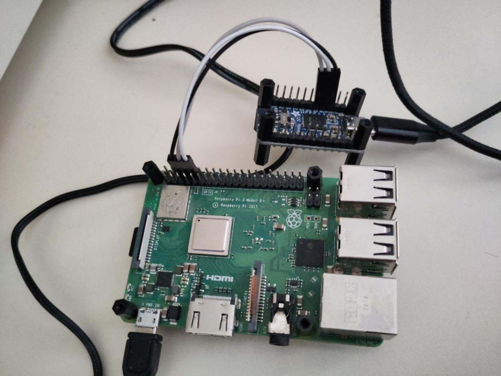
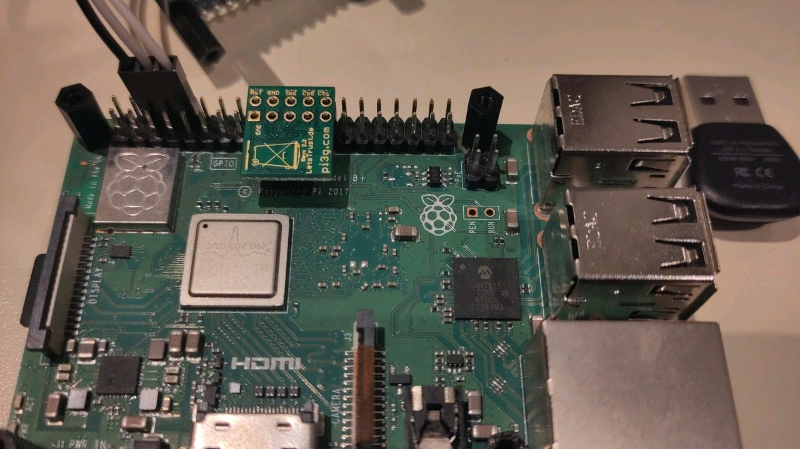

# Hardware setup

## UART-to-USB adapter

Adapter setup is unchanged from the homework assignments.
Connect the adapter as follows:



In words:

- GND is connected to RPi pin 6
- D1 is connected to RPi pin 8
- D0 is connected to RPi pin 10

## TPM

Connect the TPM:



In words:

- RST# is connected to RPi pin 18
- CS1# is connected to RPi pin 26
- The TPM faces "inwards", towards the HDMI port

There is a pin header provided to help positioning. It is used like this:


## Ethernet

Connect the Raspberry Pi and the PC using an ethernet cable. 

###Todo either assign the ethernet adapter the ip adress 10.0.0.10, or 
create something temporary
we can run mirana`s command here to check if the correct ip is assigned
# Compiling the TRENTOS application

There are no additional dependencies or changes to the build process.
Just compile it as any other TRENTOS application:

```sh
sdk/scripts/open_trentos_build_env.sh \
    sdk/build-system.sh \
    sdk/demos/demo_tpm \
    rpi3 \
    build-rpi3-Debug-demo_tpm \
    -DCMAKE_BUILD_TYPE=Debug
```

If the project directory isn't named `sdk/demo/demo_tpm`, substitute that
with its actual path.

# Transferring the build files to SD Card
After inserting the SD card to the computer, please run the following commands:

```sh
cd <Main Trentos Directory>
cp sdk/resources/rpi3_sd_card/* <SD Card mount>
cp <Build Directory>/images/os_image.elf <SD Card mount>
sync
umount <SD Card mount>
```
To find the SD Card mount, the command `df -h` can be used.

# Generating and importing a new cEK

If TRENTOS application is run for the first time on a particular TPM, it's
first necessary to let it clear the TPM, take ownership, generate a fresh
cEK, and store it in the NV storage.

On the TRENTOS side, add the following at the beginning of the file
`components/WolfTPM/trentos.c`:

```c
#define CLEAR_TPM
```

Re-compile and re-run. The TRENTOS application will print a hexdump of the
new cEK and exit.

Now, the new key must be imported into the Python client. Do:

```sh
cd python_client/
python3 importEK.py
```

And copy-paste the key into the prompt.

(Sending it over the network would've added significant complexity to the
 WolfTPM component, which doesn't seem worth it for something that ideally
 only runs once.)

Remember to remove the `#define CLEAR_TPM` and re-compile before running
the application again.

# Running the Python client

## Installing CARLA Simulator

Download the CARLA 0.9.10 from [Carla repository](https://github.com/carla-simulator/carla/blob/master/Docs/download.md). Extract the contents of the Tar file by running in the download directory:

```sh
cd <Download Directory>
tar -xvf CARLA_0.9.10.tar.gz -C <Desired Output Directory>
```
Since the client library is inside an .egg file and we want to import this to our python file, we need to extract its contents and move it to the site-packages directory of python 3.7. Please make sure python 3.7 is installed before this step. 
(check if this is the true file and try the commands)
```sh
cd <Path To Carla directory>/PythonAPI/carla/dist
unzip carla-0.9.11-py3.7-linux-x86_64.egg -d <HOME>/.local/lib/python3.7/site-packages
```

To start the simulator with low graphics setting, use the following commands:

```sh
cd <Extracted Folder>
./CarlaUE4.sh -quality-level=Low
```
# Everything together


1) Start the Carla simulator.
2) Build and transfer to SD Card
3) Setup the hardware and connect Raspberry Pi to a computer
4) Run in a terminal `sudo picocom -b 115200 /dev/<Whateve you put here>`
5) Run in another terminal `python3.7 pythonClient/bridge.py` inside main project directoy
6) Instert the SD Card into the Raspberry pi and unplug && replug the power cable

