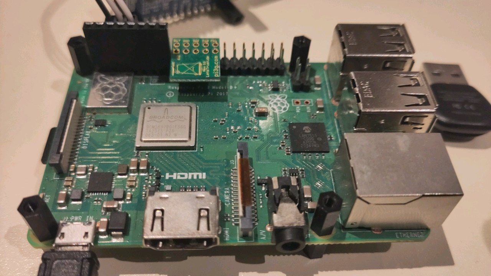

## Team Members

- Mirena Flores Valdez
- Selim Mert Kaştan
- Alisa Parashchenko

  
To compile and run the project, follow the sections in this README in the
order they appear in.

For the presentation video, refer to the link in `LinkToVideo.txt`.

There is also more detailed information in the README files of the components:
- [WolfTPM README](components/WolfTPM/README.md)
- [SecureCommunication README](components/SecureCommunication/README.md)
- [TestApp README](components/TestApp/README.md)
- [Python Client README](python_client/README.md)

Table of contents:
- [Hardware setup](#hardware-setup)
  - [UART-to-USB adapter](#uart-to-usb-adapter)
  - [TPM](#tpm)
  - [Ethernet](#ethernet)
- [Installing dependencies](#installing-dependencies)
  - [Installing Python dependencies](#installing-python-dependencies)
  - [Installing and setting up CARLA](#installing-and-setting-up-carla)
- [Generating and importing a new cEK](#generating-and-importing-a-new-cek)
- [Compiling the TRENTOS application](#compiling-the-trentos-application)
- [Running the setup](#running-the-setup)
  - [Starting CARLA Simulator](#starting-carla-simulator)
  - [Starting the Python client](#starting-the-python-client)
  - [Starting the TRENTOS application](#starting-the-trentos-application)

# Hardware setup

## UART-to-USB adapter

Adapter setup is unchanged from the homework assignments.
Connect the adapter as follows:


In words:

- GND is connected to RPi pin 6
- D1 is connected to RPi pin 8
- D0 is connected to RPi pin 10

## TPM

Connect the TPM:


In words:

- RST# is connected to RPi pin 18
- CS1# is connected to RPi pin 26
- The TPM faces "inwards", towards the HDMI port

There is a pin header provided to help positioning. It is used like this:



## Ethernet

Connect the Raspberry Pi and the PC using an ethernet cable. Assign the
static IP address 10.0.0.10 to the corresponding ethernet interface:

```sh
ip addr add 10.0.0.10/24 dev <ethernet-interface-name>
```

# Installing dependencies

## Installing Python dependencies

Install Python 3.7. 

Install `numpy` and `pycryptodome`, as the Python client depends on these
packages.

```sh
python3.7 -m pip install -r python_client/requirements.txt
```

## Installing and setting up CARLA

Download [CARLA 0.9.10](https://github.com/carla-simulator/carla/releases/tag/0.9.10/).
Extract the contents of the archive:

```sh
tar -xvf CARLA_0.9.10.tar.gz
```

Since the client library is inside an .egg file and we want to import this to
our Python file, we need to extract its contents and move it to the
site-packages of python 3.7.

```sh
cd <Path To Carla directory>/PythonAPI/carla/dist
unzip carla-0.9.10-py3.7-linux-x86_64.egg -d <Python3.7 site-packages directory>
```

If you are having problems while importing carla, please see [FAQ](https://carla.readthedocs.io/en/latest/build_faq/#importerror-no-module-named-carla).
The egg file name in the unzip command may need to be changed.

# Generating and importing a new cEK

If TRENTOS application is run for the first time on a particular TPM, it's
first necessary to let it clear the TPM, take ownership, generate a fresh
cEK, and store it in the NV storage.

On the TRENTOS side, add the following at the beginning of the file
`components/WolfTPM/trentos.c`:

```c
#define CLEAR_TPM
```

Re-compile and re-run. The TRENTOS application will print a hexdump of
the new cEK and exit.

Now, the new key must be imported into the Python client. Do:

```sh
cd python_client/
python3 importEK.py
```

And copy-paste the key into the prompt.

Remember to remove the `#define CLEAR_TPM` and re-compile before running
the application again.

# Compiling the TRENTOS application

There are no additional dependencies or changes to the build process.
Just compile it as any other TRENTOS application:

```sh
sdk/scripts/open_trentos_build_env.sh \
    sdk/build-system.sh \
    ws2023_team_3_ads_tpm \
    rpi3 \
    build-rpi3-ws2023_team_3_ads_tpm \
    -DCMAKE_BUILD_TYPE=Debug
```

If the project directory isn't named `ws2023_team_3_ads_tpm`, substitute that
with its actual path, relative to the TRENTOS root directory.

# Running the setup

## Starting CARLA Simulator

To start the simulator with low graphics setting, use the following commands:

```sh
cd <Path To Carla directory>
./CarlaUE4.sh -quality-level=Low
```

## Starting the Python client

To launch the Python client with default parameters and the default scenario,
do:

```sh
cd python_client/
python3.7 bridge.py
```

Use the `-s` option (e.g. `-s scenario1.txt`) to choose a different scenario.
The following scenarios are already supplied:

<table>
  <tr>
    <td>
      
      <br>
      <i>Default Scenario</i> (<code>default_scenario.txt</code>)
    </td>
    <td>
      
      <br>
      <i>Scenario 1</i> (<code>scenario1.txt</code>)
    </td>
  </tr>
  <tr>
    <td>
      
      <br>
      <i>Scenario 2</i> (<code>scenario2.txt</code>)
    </td>
    <td>
      
      <br>
      <i>Scenario 3</i> (<code>scenario3.txt</code>)
    </td>
  </tr>
</table>

Refer to the [Python client README](python_client/README.md) for further
options.

## Starting the TRENTOS application

Mount the SD card, then copy over the files:

```sh
cp sdk/resources/rpi3_sd_card/* <SD Card mount>
cp <Build Directory>/images/os_image.elf <SD Card mount>
```

Unmount it and insert it into the Raspberry Pi.

Start Picocom (substituting `/dev/ttyUSB0` with the correct path, if needed):

```sh
sudo picocom -b 115200 /dev/ttyUSB0
```

Turn on the Raspberry Pi.
