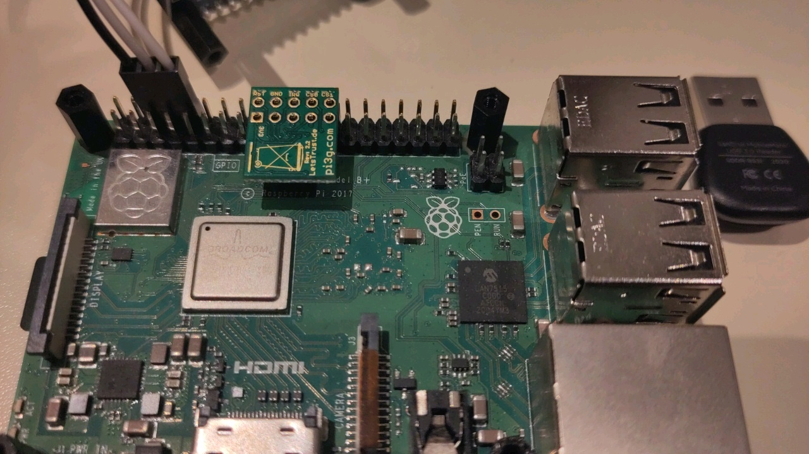
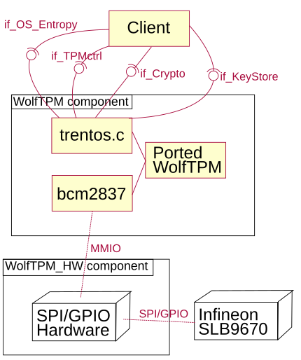

# TRENTOS WolfTPM Component

This component implements interfaces for communicating with a TPM, such as
key storage and asymmetric encryption/decryption.

It uses the external `WolfTPM` and `bcm2837` libraries. See the "Structure"
section for details.

## Setup

### Hardware

The TPM is connected to the Raspberry Pi as follows:



In words:
- RST# is connected to RPi pin 18
- CS1# is connected to RPi pin 26
- The TPM faces "inwards", towards the HDMI port

There is a pin header provided to help positioning. It is used like this:


### Changes to config.txt

The following line **must** be added to `config.txt`:

```text
enable_jtag_gpio=0
```

Otherwise, the TPM will not work! It will keep reading zeroes over SPI instead
of actual input.

## Connecting the WolfTPM component

### CAmkES

In the main CAmkES file of the project, include the WolfTPM CAmkES file:
```camkes
#include "components/WolfTPM/WolfTPM.camkes"
```

Add the following lines to declare the WolfTPM components:

```camkes
  composition {
    component WolfTPM    wolfTPM;
    component WolfTPM_HW wolfTPM_HW;

    // ...
```

The `WolfTPM_HW` component is needed so that the WolfTPM component (or, more
specifically, the `bcm2837` library it uses) can talk to the SPI/GPIO hardware
of the Raspberry Pi using MMIO.

Connect these two components:

```camkes
    WolfTPM_HW_CONNECT(wolfTPM, wolfTPM_HW);
```

Connect a client as follows:

```camkes
    WolfTPM_INSTANCE_CONNECT_CLIENT(
        wolfTPM,
        <client>.entropy_rpc, <client>.entropy_dp,
        <client>.keystore_rpc, <client>.keystore_dp,
        <client>.crypto_rpc, <client>.crypto_dp
    )

    // ...
  } // end of composition
```

Add the following line to the configuration section:

```camkes
  configuration {
      // ...
      WolfTPM_HW_CONFIGURE_SELF(wolfTPM_HW)
      // ...
  }
```

### CMake

In the main `CMakeLists.txt`, include WolfTPM's `CMakeLists.txt`:

```cmake
include(components/WolfTPM/CMakeLists.txt)
```

Declare the WolfTPM component:

```cmake
WolfTPM_DeclareCAmkESComponent(WolfTPM)
```

This component provides some custom interfaces. These must also be mentioned
in the CMake file:

```cmake
CAmkESAddCPPInclude(interfaces/camkes)
CAmkESAddImportPath(interfaces/camkes)
```

### C Source Files

Include the necessary headers:

```c
#include "interfaces/if_OS_Entropy.h"
#include "if_KeyStore.h"
#include "if_Crypto.h"
```

And assign the necessary data structures:

```c
if_OS_Entropy_t entropy = IF_OS_ENTROPY_ASSIGN(entropy_rpc, entropy_dp);
if_KeyStore_t keystore = IF_KEYSTORE_ASSIGN(keystore_rpc, keystore_dp);
if_Crypto_t crypto = IF_CRYPTO_ASSIGN(crypto_rpc, crypto_dp);
```

## Interfaces

### `if_OS_Entropy_t`

This interface provides exactly one function:
```
size_t read(const size_t len)
```

When invoked, it places `len` bytes in the dataport. If `len` exceeds the size
of the dataport, it only places as many bytes as the size of the dataport.
The return value is the amount of bytes that were placed in the dataport.

### `if_KeyStore`

This interface provides four functions.

```c
void getCEK_RSA2048(uint32_t *exp)
void getCSRK_RSA1024(uint32_t *exp)
```

These functions get the cEK and cSRK respectively. The exponent is written out
to `*exp`, while the key itself is placed in the dataport.

These functions cannot fail, because if cEK or cSRK generation had failed, that
would've happened during the initialization of the `WolfTPM` component, and
the thread would've been aborted, so the code that invokes these functions
would've never been reached.

```c
uint32_t storeKey(uint32_t len, uint32_t exp)
int loadKey(uint32_t hdl, uint32_t *len, uint32_t *exp)
```

These functions are responsible for non-volatile storage of keys.

`storeKey` takes a key length (in bytes) and the key's exponent as parameters,
and expects the key data itself in the dataport. If successful, it returns a
handle that can be used to load the key. If failed, it returns `(uint32_t) -1`.

`loadKey` takes a handle created by `storeKey`. It writes out the key length
to `*len` and the exponent to `*exp`. The key data is placed in the dataport.
It returns `0` on success and non-zero on failure.

Note that in the current implementation, the "handle" is just an offset into
the NV index. It is possible to manipulate it to get data at a different
offset.

### `if_Crypto`

This interface provides an `enum`:

```c
enum if_Crypto_Key {
      IF_CRYPTO_KEY_CEK,
      IF_CRYPTO_KEY_CSRK
};
```

And two functions:

```c
int decrypt_RSA_OAEP(int key, int *len)
int encrypt_RSA_OAEP(int key, int *len)
```

The `key` parameter must be a valid `enum if_Crypto_Key`, and specifies the
key to use for encryption/decryption. `*len` must be set to the length
(in bytes) of the input data, and after return, it will be set to the length
of the output data.

The input data itself is expected in the dataport, and will be overwritten with
the output data. This construction avoids unnecessary copying, and makes it
convenient to perform multiple encryption steps. For example:

```c
// Assuming length has been previously set
// decrypt(cSRK, decrypt(cEK, ciphertext)
crypto.decrypt_RSA_OAEP(IF_CRYPTO_KEY_CEK, &len))
crypto.decrypt_RSA_OAEP(IF_CRYPTO_KEY_CSRK, &len))
```

## Examples

See the `TestApp` of the `tpm_with_wolftpm` branch for an example of how to
connect to the `WolfTPM` component and use its functions.

## Structure

- `trentos.c` implements the interfaces and handles the initialization
  of the TPM.
- `wolftpm/` and `src/` contain wolfTPM source code. Except for deleting files
  that are unused in this particular configuration, they are unmodified. They
  were obtained from:
  https://github.com/wolfSSL/wolfTPM/archive/refs/tags/v3.1.0.tar.gz
- `wolftpm/options.h` contains wolfTPM configuration options. Normally,
  this file would be generated by `./autogen.sh` and then `./configure`.
  As the configuration needed for TRENTOS is known in advance (and also as
  I don't know how to use GNU Autotools or `./configure` in the TRENTOS build
  process), I instead manually wrote down all necessary options in this file.
- `hal/` contains all the files used for WolfTPM's Hardware Abstraction Layer.
- `hal/tpm_io.{c,h}` were copied from WolfTPM source code and minimally
  modified to add my custom input/output function.
- `hal/tpm_io_trentos.c` is my custom input/output function for TRENTOS on
  Raspberry Pi.
  (Or rather, a very thin wrapper around `bcm2837_spi_transfernb`.)
- `hal/bcm2837/` is the external `bcm2837` library, which my input/output
  function uses.
- `pics/` contains the pictures used in this README.

Structure diagram:



## Assumptions

Assumption: There is only one client connected to the WolfTPM component,
            and there is only one instance of the WolfTPM component.

Absolutely no support has been made for multithreading or synchronisation,
since it's not needed for this assignment.

Assumption: The TPM is an Infineon SLB9670.

While all models of TPM are supposed to follow the same standard, there are
implementation differences, such as maximum SPI frequency. Currently, the model
of the TPM is hard-coded in `wolftpm/options.h`, and model-specific GPIO pins,
Chip Select and frequency are hard-coded in `trentos.c`.
